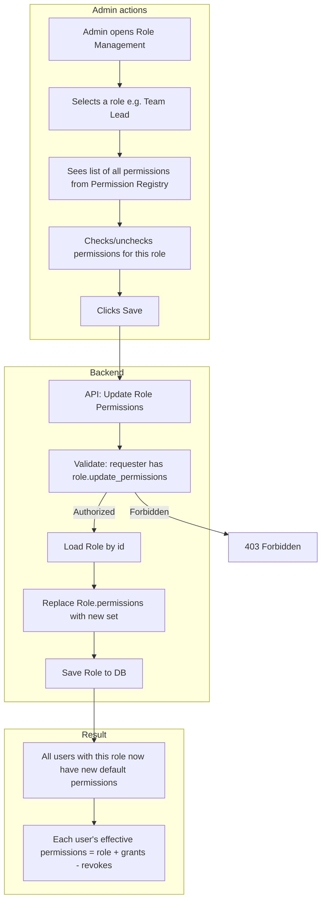
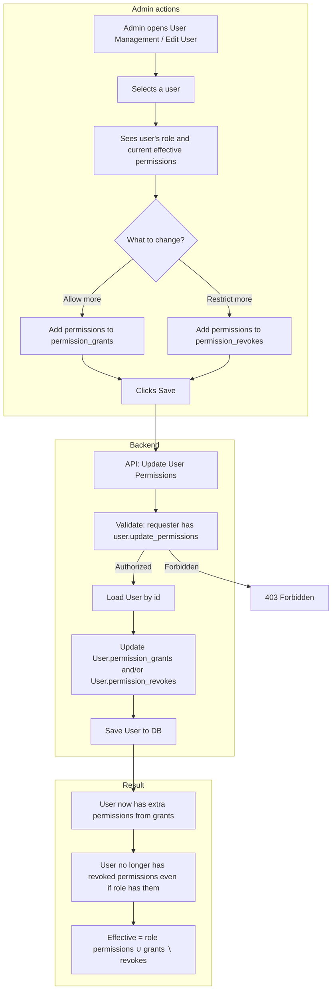
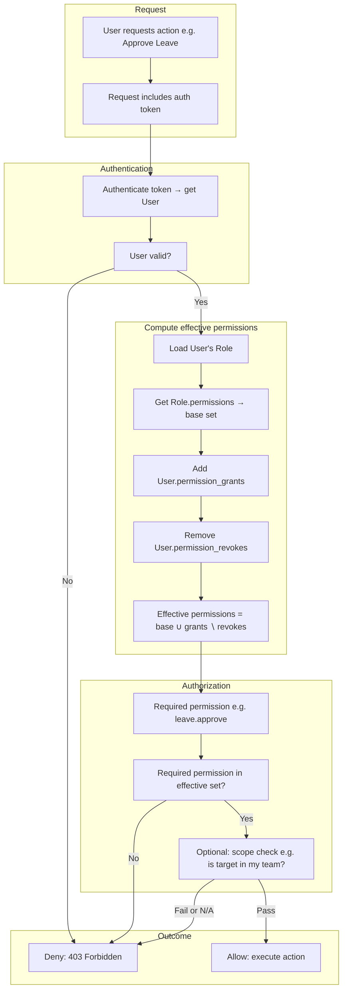
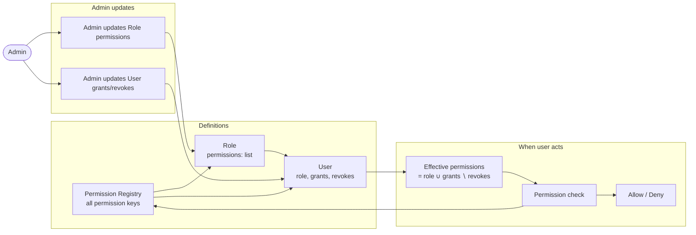
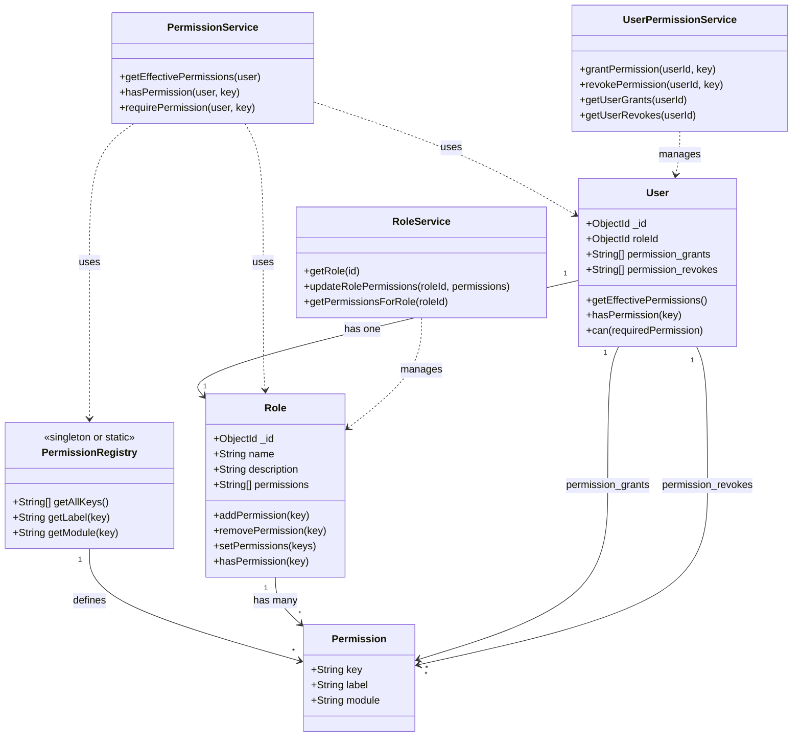
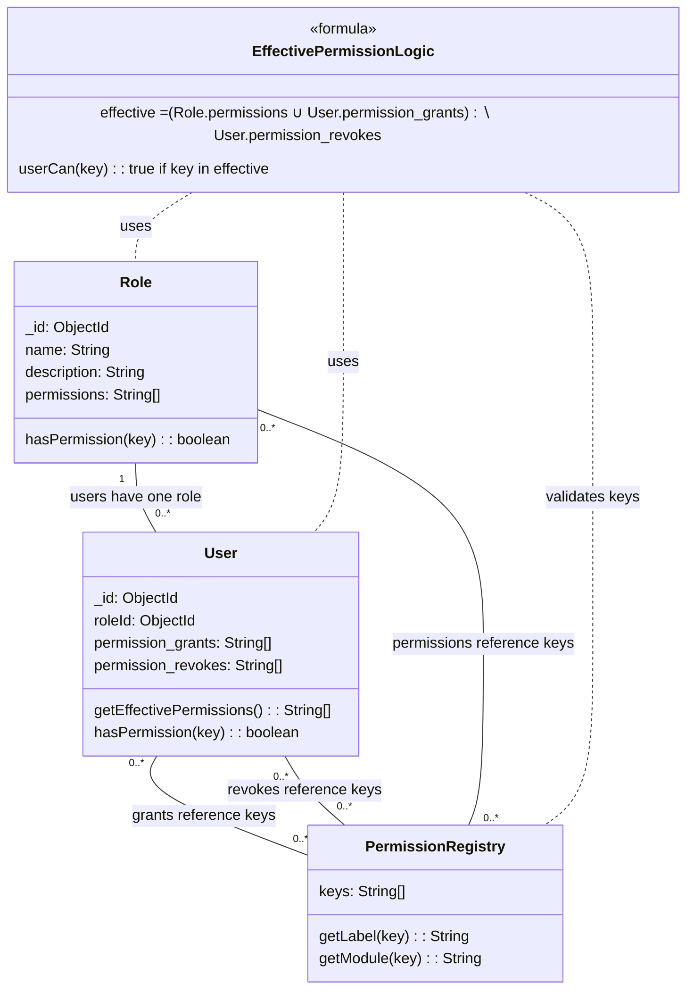
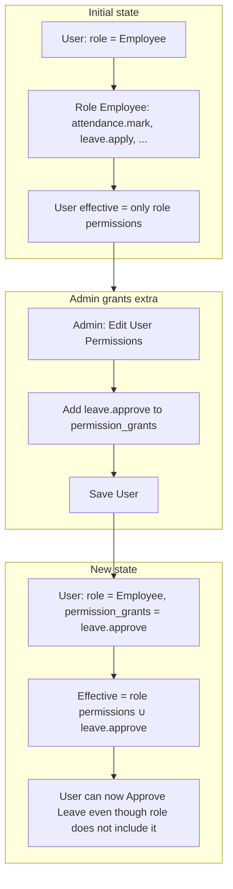
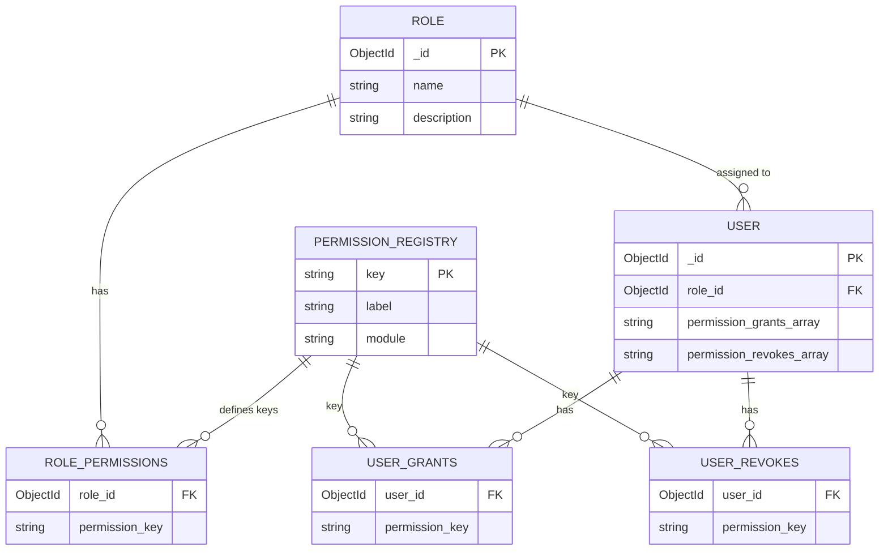
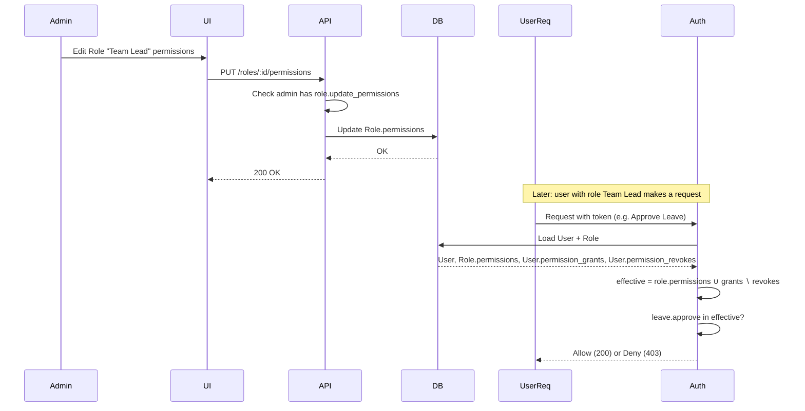
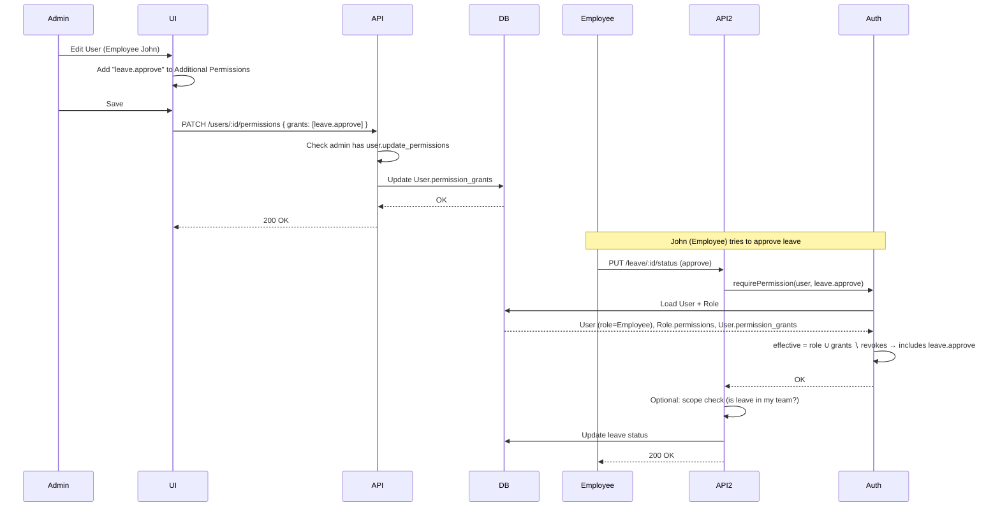

# AMS Permissions — Mermaid Flowcharts & Class Diagram

Use these Mermaid code blocks in any Mermaid-compatible viewer (e.g. GitHub, Notion, Mermaid Live Editor, or VS Code Mermaid extension) to draw the permission model.

---

## 1. Flowchart: Admin updates a role’s permissions

Shows how an admin changes which permissions a role has. All users with that role get the new set (subject to their per-user grants/revokes).

---

## 2. Flowchart: Admin grants or revokes permissions for a user

Shows how an admin gives a user extra permissions (beyond their role) or revokes some of their role’s permissions.

---

## 3. Flowchart: User performs an action — permission check

Shows how the system decides whether a user can perform an action (e.g. approve leave). It uses effective permissions (role + grants − revokes).

---

## 4. Flowchart: High-level permission flows (overview)

Single diagram summarizing: who can change what, and how a user’s allowed actions are determined.

---

## 5. Class diagram: Permissions, roles, and users

Shows the main entities and how effective permissions are derived. Methods are the main operations you’d implement.

---

## 6. Class diagram: Detailed (with effective permission formula)

Same idea as above, with the effective-permission formula and relationships spelled out.

---

## 7. Flowchart: “Admin allows more permissions than role” (grant path)

Focus on the case: user has a role (e.g. Employee) with a fixed set; admin gives that user extra permissions (e.g. `leave.approve`).

---

## 8. Entity relationship (roles, users, permissions)

Useful to see how Role, User, and the permission lists relate at the data level.

---

## 9. Sequence: Admin updates role permissions → user’s next request

Shows the order of operations: admin saves new role permissions, then the next time a user with that role makes a request, they get the new effective set.

---

## 10. Sequence: Admin grants user an extra permission → user uses it

Shows admin adding a permission to a user’s `permission_grants`, then that user successfully performing the action.

---

## How to use

- **Flowcharts (1–4, 7):** Permission flows and “who can change what.”
- **Class diagrams (5–6):** Data model and services (Role, User, effective permissions).
- **ER (8):** Tables/collections and relationships.
- **Sequences (9–10):** Step-by-step for “admin updates role” and “admin grants user → user uses it.”

Copy any code block into [Mermaid Live Editor](https://mermaid.live) or your docs to render the diagrams.
